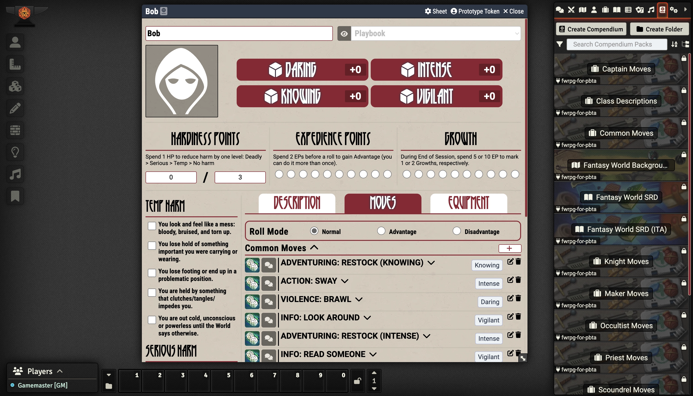

# Fantasy World RPG


### THIS DOCUMENTATION IS NO LONGER USED

Go to [https://github.com/asacolips-projects/pbta/wiki/#getting-started](https://github.com/asacolips-projects/pbta/wiki/#getting-started) for the most current version of the documentation.


## Author

* **Url:** https://github.com/Rangertheman
* **Discord:** Krister Persson

## Code Repository:

https://github.com/Rangertheman/fwrpg-for-pbta/tree/master

## Foundry VTT Page:

https://foundryvtt.com/packages/fwrpg-for-pbta

## Features

* Adds playbooks and moves.
* Configures the actor and NPC sheets for Fantasy World RPG.
