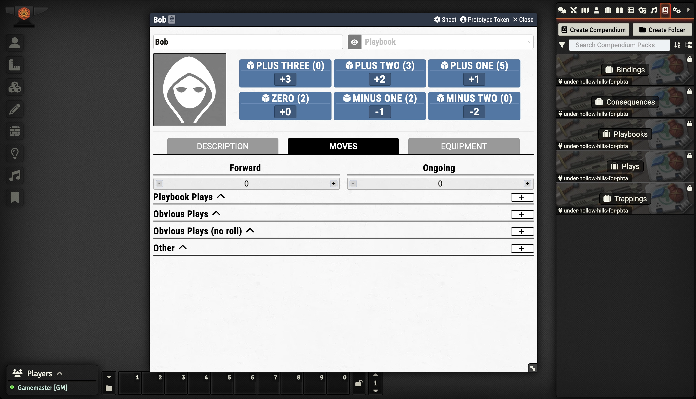

# Under Hollow Hills


### THIS DOCUMENTATION IS NO LONGER USED

Go to [https://github.com/asacolips-projects/pbta/wiki/#getting-started](https://github.com/asacolips-projects/pbta/wiki/#getting-started) for the most current version of the documentation.


## Author

* **Url:** https://github.com/inigo
* **Discord:** Inigo

## Code Repository:

https://github.com/inigo/under-hollow-hills-foundryvtt

## Foundry VTT Page:

https://foundryvtt.com/packages/under-hollow-hills-for-pbta

## Features
